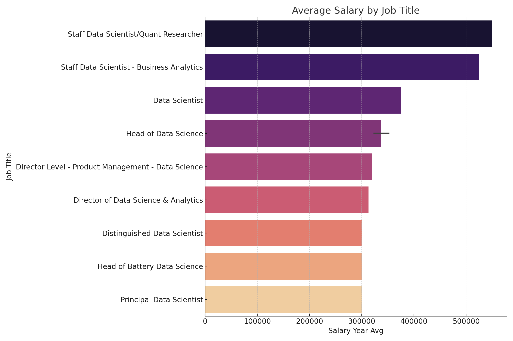

# Introduction
This project focuses on analyzing job market data related to data roles using SQL and various data analysis tools. The goal is to uncover meaningful insights about hiring trends, skill requirements, and salary patterns in the data job sector. By leveraging real-world job posting datasets, the project aims to provide a comprehensive overview of the current landscape for data professionals.

SQL quries? Check them out here : [project_sql folder](/Project_sql/)

# Background
The demand for data professionals—such as data analysts, data scientists, and data engineers—has surged in recent years. Organizations across industries are seeking talent with strong analytical and technical skills to drive data-driven decision-making. However, the specific requirements, qualifications, and trends within the data job market can be complex and ever-changing. This project was initiated to systematically explore these aspects, helping both job seekers and employers better understand the evolving market.

# Tools Used
- **SQL Server**: Served as the primary platform for storing, cleaning, and querying large datasets efficiently.
- **Microsoft Excel**: Used for preliminary data cleaning, exploration, and simple visualizations to identify initial patterns.
- **Power BI**: Enabled the creation of interactive dashboards and advanced visualizations to communicate findings effectively.
- **Python (optional)**: Utilized for additional data preprocessing and automation tasks, such as data extraction and transformation.

# The Analysis
### 1. Top paying Data Scientist Jobs
Here is a SQL query to find the top 10 highest paying remote Data Scientist jobs, including job details and company names:
``` sql
SELECT
    job_postings_fact.job_id,
    job_postings_fact.job_title,
    job_postings_fact.job_location,
    job_postings_fact.job_schedule_type,
    job_postings_fact.salary_year_avg,
    job_postings_fact.job_posted_date,
    name AS company_name
FROM
    job_postings_fact
LEFT JOIN company_dim ON job_postings_fact.company_id = company_dim.company_id
WHERE
    job_postings_fact.salary_year_avg IS NOT NULL AND
    job_location= 'Anywhere' AND
    job_title_short= 'Data Scientist'
ORDER BY
    job_postings_fact.salary_year_avg DESC
LIMIT 10;
```
This SQL query retrieves the top 10 highest-paying remote Data Scientist jobs from a database. It joins job postings with company information, filters for jobs with a known average yearly salary, a location of "Anywhere" (indicating remote work), and a short job title of "Data Scientist". The results are ordered by salary in descending order, showing the best-paying positions first.
## Result 


The chart above displays the top 10 highest-paying remote Data Scientist jobs, highlighting both the companies and salary ranges. It reveals that remote roles can offer highly competitive salaries, with certain companies leading the market in compensation for data professionals. This insight can help job seekers target organizations that value and reward data science expertise.

### 2. Skills for Top Paying Jobs

 Skills Required for Top Paying Data Scientist Jobs

```sql
WITH top_paying_jobs AS (
    SELECT
        job_id,
        job_title,
        salary_year_avg,
        name AS company_name
    FROM
        job_postings_fact
    LEFT JOIN company_dim ON job_postings_fact.company_id = company_dim.company_id
    WHERE
        job_postings_fact.salary_year_avg IS NOT NULL AND
        job_location= 'Anywhere' AND
        job_title_short= 'Data Scientist'
    ORDER BY
        job_postings_fact.salary_year_avg DESC
    LIMIT 10
)
SELECT 
    top_paying_jobs.*,
    skills 
FROM top_paying_jobs
INNER JOIN skills_job_dim ON top_paying_jobs.job_id = skills_job_dim.job_id
INNER JOIN skills_dim ON skills_job_dim.skill_id = skills_dim.skill_id
ORDER BY top_paying_jobs.salary_year_avg DESC;
```
This SQL query identifies the top 10 highest-paying remote Data Scientist jobs and lists the specific skills required for each. It first selects these jobs based on salary, then joins related tables to retrieve the associated skills for each job. The result helps reveal which skills are most valued in top-paying Data Scientist positions.
### 3. Top demanded skills

Top 5 Most In-Demand Skills for Remote Data Scientist Roles
```sql
SELECT
    skills,
    COUNT(skills_job_dim.job_id) AS demand_count
FROM job_postings_fact
INNER JOIN skills_job_dim ON job_postings_fact.job_id = skills_job_dim.job_id
INNER JOIN skills_dim ON skills_job_dim.skill_id = skills_dim.skill_id
WHERE
    job_title_short = 'Data Scientist'
    AND job_work_from_home = TRUE
GROUP BY
    skills
ORDER BY
    demand_count DESC
LIMIT 5;
```
This SQL query identifies the top 5 most in-demand skills for remote Data Scientist positions. It joins job postings with associated skills, filters for remote Data Scientist roles, counts how often each skill appears, and lists the skills with the highest demand.
## Results


The chart above highlights the five most sought-after skills for remote Data Scientist roles. These skills are frequently mentioned in job postings, indicating their high demand in the current market. Mastery of these skills can significantly improve job prospects for aspiring data professionals.
### 4. Top paying skills
Top Paying Skills for Remote Data Scientist Roles
```sql
SELECT
    skills,
    ROUND(AVG(salary_year_avg), 2) AS avg_salary
FROM job_postings_fact
INNER JOIN skills_job_dim ON job_postings_fact.job_id = skills_job_dim.job_id
INNER JOIN skills_dim ON skills_job_dim.skill_id = skills_dim.skill_id
WHERE
    job_title_short = 'Data Scientist'
    AND job_work_from_home = TRUE
    AND salary_year_avg IS NOT NULL
GROUP BY
    skills
ORDER BY
    avg_salary DESC
LIMIT 25;
```
The following SQL query identifies the top 25 skills associated with the highest average salaries for remote Data Scientist positions. It calculates the average salary for each skill and lists them in descending order, helping to highlight which skills are most lucrative in the current market.
### 5. Optimal skills
Optimal Skills Balancing Demand and Salary
``` sql
SELECT
    skills_dim.skill_id,
    skills_dim.skills,
    COUNT(skills_job_dim.job_id) AS demand_count,
    ROUND(AVG(job_postings_fact.salary_year_avg), 0) AS avg_salary
FROM job_postings_fact
INNER JOIN skills_job_dim ON job_postings_fact.job_id = skills_job_dim.job_id
INNER JOIN skills_dim ON skills_job_dim.skill_id = skills_dim.skill_id
WHERE
    job_postings_fact.job_title_short = 'Data Scientist'
    AND job_postings_fact.job_work_from_home = TRUE
    AND job_postings_fact.salary_year_avg IS NOT NULL
GROUP BY
    skills_dim.skill_id
HAVING
    COUNT(skills_job_dim.job_id) > 10
ORDER BY
    avg_salary DESC,
    demand_count DESC
LIMIT 25;
```
The query identifies the top 25 in-demand skills for remote Data Scientist jobs, ranked by average salary and demand.
# What I Learned
- Strengthened my ability to write advanced SQL queries for extracting, joining, and analyzing real-world job market data.
- Gained practical experience in identifying high-paying roles and in-demand skills by leveraging SQL, Power BI, and Excel.
- Learned how to integrate multiple data sources and perform comprehensive data cleaning and transformation.
- Improved my skills in designing clear, interactive dashboards and visualizations to communicate insights effectively.
- Developed a deeper understanding of the evolving data job landscape, including salary trends and skill requirements for remote roles.
- Appreciated the importance of data quality and the nuances of interpreting job posting datasets for actionable insights.

# Conclusion
This project provided hands-on experience in conducting a full-cycle data analysis using industry-standard tools. The insights generated can help job seekers tailor their learning paths and resumes to align with market demands, while organizations can use the findings to refine their recruitment strategies. Overall, the project reinforced the value of data-driven approaches in understanding and navigating the dynamic job market for data professionals.